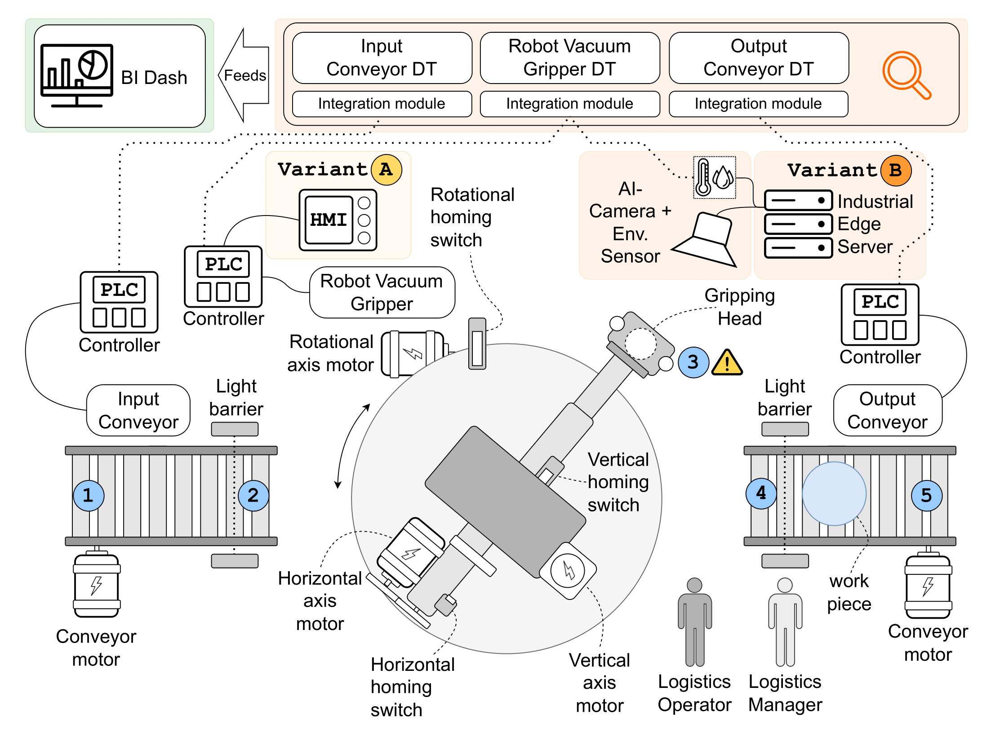
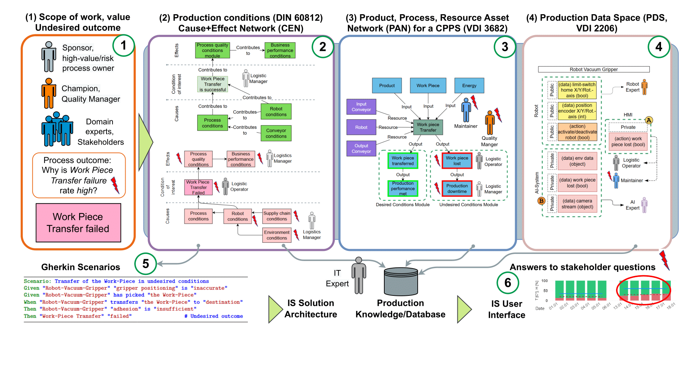
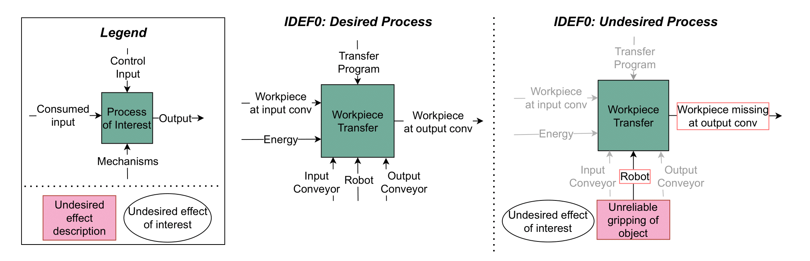
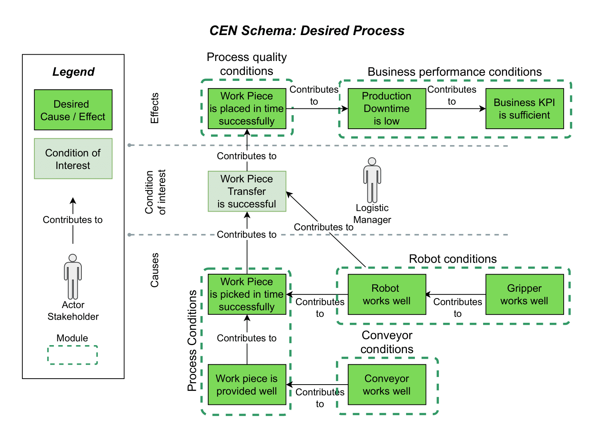
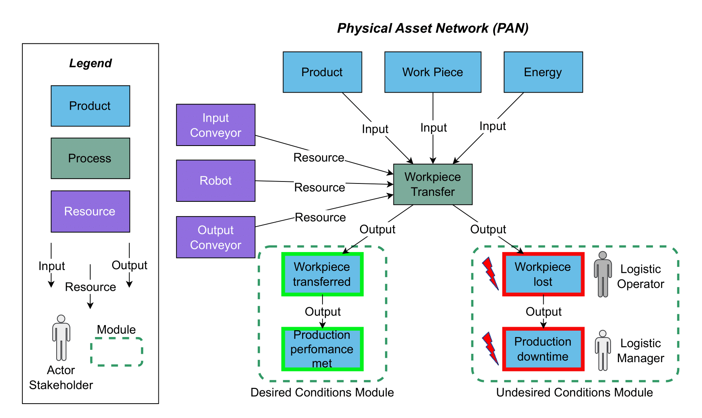
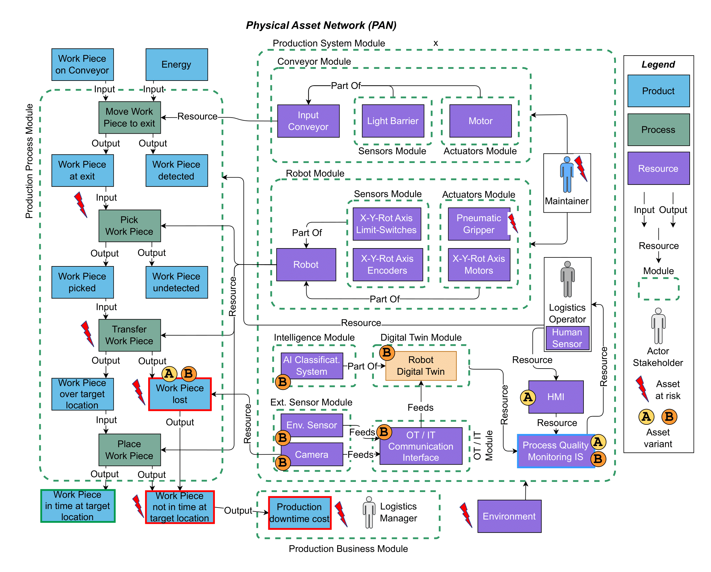

# Process Quality Monitoring with Behavior-Driven Development Methodology

In the Industry 4.0 context, a new level of automation is expected to hit day by day operations, unlocked by recent advancements in IT and related technologeis. Yet, how to capture the tacit, scattered knowledge, for both desired and undesired industrial scenarios, needed for an effective digitalization of industrial process aimed at Process Quality Monitoring (PQM) and associated improvement, remains unclear. 

The following public resource integrates the manuscript  entitled "*Business Intelligence Architecture for Process Quality Monitoring with BDD*", a scientific article aimed at introducing an innovative methodology for: 

- (i) representing the physical system structure, processes, and cause-effects relations, in both desired and undesired variants for an effective PQM improvement;
- (ii) use depicted representation in conjunction with  Behavior-Driven Development (BDD) capabilities to highlight conditions of interest to effectively design the target a PQM information system with Digital Twins (DTs) functions.

## The Concept of *Digital Twin*

A Digital Twin (DT) is a digital counterpart of a physical asset that exists in the real world. Within the IoT landscape, DTs have emerged as digital entities continuously updated with real-time data from their physical counterparts, thereby supporting their management and enhancing their performance.

In cyber-physical environments, and particularly in industrial contexts, DTs are becoming a cornerstone technology. They help to break down traditional data silos, enable collaboration across systems, improve data extraction, standardization, and processing, and introduce new layers of intelligence. 

Thanks to their abstraction capability—namely, the ability to represent any physical asset regardless of its underlying details—DTs serve as a homogenizing layer that strengthens the interaction between upper-level digital applications and physical systems. Furthermore, their ability to augment the properties and functionalities of their physical counterparts is a defining feature, opening new opportunities to enhance system visibility and overall intelligence.

In this scenario, the role of Industrial Digital Twins is well defined: they operate as a dynamic extension of the physical system, enabling horizontal integration across heterogeneous assets and fostering vertical collaboration with advanced digital tools.

## Running Example

The physical system of reference used to test the methdology is depicted in the following image. It is composed by 2 conveyors, with a *Robot-Vacuum Gripper* transfering material from the first to the second. The whole system is driven by industry-grade hardware. 

We recall here that the physical system is connectable to the network, and is affected by an apparently random undesired loss of the workpiece during operations.

All the artifacts represented here-after (and in the manuscript as well) are referred to the depicted system. For more information, look at the relative section in the article. 

<div align="center">
    
</div>
<div align="center">
    <figcaption>
        <em>Physical system of reference.</em>
        <br>
        <br>
    </figcaption>
</div>


## Methodology Overview

The methdology has a total of 5 steps (see the image below), with the 6<sup>th</sup> step representing the development of the final cyber-physical system. 

<div align="center">
    
</div>
<div align="center">
    <figcaption>
        <em>Methodology steps and representation of the expected output artifacts for each of them.</em>
        <br>
        <br>
    </figcaption>
</div>

### Step 1: Define an UndesiredOoutcome in the Scope of Work

The first step involves the definition of stakeholders of interest and the high-level representation of the process under exam, using the IDEF0 notation. 

Represented scenarios consider both *desired* (i.e., the normal execution of the system, without any disruption) and *undesired* - focused on a particular unexpected event - use cases.

<div align="center">
    
</div>
<div align="center">
    <figcaption>
        <em>Representation of the process carried out by the system under exam using the IDEF0 notation.</em>
        <br>
        <br>
    </figcaption>
</div>


### Step 2: Analyze Production Conditions in a Cause-Effect Network

At this step, the Cause-Effect-Network (CEN) of the desired process is built. Users start from the condition of interest, depicting its effects in the appropriate area. Then, causes leading to the effect of interest are reported as well, backtracking until potential root causes are reached.

<div align="center">
    
</div>
<div align="center">
    
</div>
<div align="center">
    <figcaption>
        <em>CEN for Desired and Undesired Conditions; causes and effects can vary substantially between the two graphs, as the condition of interest in each case can be caused - and generate - different scenarios. The CEN for undesired conditions here proposed is the extendend version of the manuscript.</em>
        <br>
        <br>
    </figcaption>
</div>


### Step 3: Validate Production Conditions with Production Assets

The relationship existing between physical assets involved in the process, and the process itself are depicted at this step. The result, is a Process-Assets-Network (PAN), reporting all the process steps, each input and output, and assets (or their subparts) carrying out the process. The PAN can be *condensed* or *expanded* by grouping elements into appropriate modules. The same can be applied also for CENs. 

<div align="center">
    
</div>
<div align="center">
    <figcaption>
        <em>Condensed PAN for the considered physical scenario.  For the expanded version, see the next image.</em>
        <br>
        <br>
    </figcaption>
</div>

This first variant depicted above, describes the relationship existing between the input to the process, involved assets, and resulting desired and undesired outcomes, in a summarized view.

In its *expanded* version (below), assets and processes are described with a higher level of granularity, intwgrating (in this case) also potential variants of the system which are taken into consideration to solve the undesired condition of interest of the system.

<div align="center">
    
</div>
<div align="center">
    <figcaption>
        <em>Caption.</em>
        <br>
        <br>
    </figcaption>
</div>

The resulting PAN is the checked against CENs, to verify its feasibility and consistency. Moreover, at this step a list of asset properties - extracted from the resulting PAN, and cross-checked with the CEN - is also redacted, to describe the state of each asset at different states of the process reported in the PAN or in the CEN. The resulting list of asset properties is hereafter reported: 

``` 
Products: 
    - Work Piece
        ● Location
            ○ History
        ● State
            ○ Damaged
            ○ Lost
        ● Type
            ○ Variance
    - Energy
        ● State
    - Production downtime
        ● Cost
        ● Duration in time window
    - Unplanned maintenance
    - Business KPI

---

Processes:
    - Move WP to exit
        ● State
        ● Success in time window
    - Pick WP
        ● State
        ● Success in time window
    - Transfer WP
        ● State
        ● Success in time window
        ● Failure rate
    - Place WP

---

Resources:
    - Production system
        ● Robot
            ○ State
            ○ Transfer capability
                ■ State
            ○ Acceleration
                ■ State
                ■ Threshold
            ○ Pneumatic Gripper
                ■ State
                ■ Adhesion capability
                    ● State
                    ● Threshold
                ■ Positioning capability
                    ● State
                    ● Threshold
            ○ Sensors
                ■ X-Y-Rot Axis limit switches
                    ● State
                ■ X-Y-Rot Axis encoders
                    ● State
            ○ Motors
                ■ X-Y-Rot Axis motors
                    ● State
        ● Input conveyor
            ○ State
            ○ Sensor light barrier
            ○ Motor
        ● Output conveyor
            ○ State
        ● Human sensor
        ● Operator HMI
        ● Process Quality Monitoring Information System
        ● Robot Digital Twin
        ● AI Classification System
        ● OT/IT Communication Interface
    - Environment
        ● Humidity
            ○ State
            ○ Threshold

---

Stakeholders:
    - Logistics Manager
        ● Capability
        ● State
    - Logistics Operator
        ● Capability
        ● State
    - Maintainer
        ● Capability
        ● State
```


### Step 4: Validate Production Conditions with Production Data Space

Assets and properties collected at Step 3 are the taken into account by IT experts to check and validate access to the sources required to monitor the target data for modeling conditions of interest in the digital space. The result of this step is a collection of data sources and associated data points, a list of stakeholders having access to related data sources, and a list of missing data points that can improve the modeling of the system.

<div align="center">
    
</div>
<div align="center">
    <figcaption>
        <em>Expanded PDS for the given running example. In the image, two potential updates variants are reported, one involving an HMI to manually inform for the loss of the workpiece (A), and another automatizing the collection of the same information (B).</em>
        <br>
        <br>
    </figcaption>
</div>


### Step 5: Derive BDD Scenarios for Monitoring Conditions

Artifacts produced so far are then used to effectively build BDD scenarios. The goal of scenarios is to guide the development - or even provide early checks - of the Information System aimed at monitor production performance spotting pontential undesired conditions or provide early warnings.

BDD scenarios - built with Gherkin - for system monitor improvement in Cyber-Physical Production Systems (CPPSs) respect the following structure: 

``` gherkin
Scenario: Conditions for a production process
    Given <direct or indirect process pre-condition> # cf. condition network
    When <process>                                   # cf. asset network
    Then <direct process post-condition>             # cf. condition network
```

<!--In particular, the first `Given` condition is taken from the condition network (i.e., the CEN), the `When` refers to a process step in the asset network, and the final `Then` recalls a condition connected to the one at the `Given` in the condition network. -->

For example, consider the following *desired condition*:

``` gherkin
Scenario: Move work piece on conveyor to exit
    Given "the work piece" on "the input conveyor"
    When "the input conveyor" moves "the work piece"
    Then "the work piece" arrives "at the exit" "in time"
```

In this case, all of the conditions are described in the PAN. 

Alternatively, consider the following *undesired condition*:

``` gherkin
Scenario: Transfer the work piece with challenging condition
    Given "gripper adhesion" to "the work piece" is "insufficient"
    When "the robot gripper" transfers "the work piece"
    Then "the work piece" does not arrive over "the target location" "in time"
    Then "the system" shall alert "the quality manager"
```

<!-- TODO: add a reference to other tests -->

In this case, the condition at `Given` is taken from the CEN in its *undesired condition* variant, while the `When` refers to a specific process step reported in the PAN. Finally, the first `Then` refers to the actual effect described in the same CEN for *undesired conditions*, as it represents an effect of the happening described in the `Given` condition. The second `Then`, instead, is a projected reaction of the sytsem, which must react to all the events depicted in the scenario. 

Interstingly, the scenario does *not explicitely* model the actual loss of the workpiece, since the original system is not capable of track such information. The missing data point is indeed highlighted in the PDS, which can be then implemented through the two system variants depicted in the PAN. 

In the second variant reported in the PAN, the concept of Digital Twin is involved. Digital Twins act as powerful mediators to integrate data from industrial heterogenous data sources (indeed, it is not expected have the ability of integrating the camera monitoring the transfering area through traditional industrial controllers), to, consequently augment the capabilities of the digitalized physical assets. In the given context, BDD scenarios act as a powerful tool to, as they (i) guide stakeholders through the definition and refinment of scenarios of interest, and (ii) can be used to build quality tests of the resulting information system, which, in this case, is represented by the modeled Digital Twin.


### (Extra) Step 6: From the Physical Representation to the Digital Twin Architecture

<div align="center">
    
</div>
<div align="center">
    <figcaption>
        <em>Resulting DT architecture, connecting assets modules to external applications interested in observing the physical system. The Robot-Vacuum-Gripper-DT acts as a a module integrating data coming from the industrial system and the additional camera, extracting the information of interest through the AI-Classification Module.</em>
        <br>
        <br>
    </figcaption>
</div>

The assets represented in the PAN module form the basis for building the associated DT architecture. Since each DT reflects a ***physical context***, choosing which DTs to model is crucial to achieving a faithful digital representation of the physical assets of interest.

For example, in some cases, it may be useful to adopt a single, monolithic DT to represent an entire department as a single entity in the digital domain. In other contexts, however, a greater level of detail is more advantageous: in this second approach, multiple DTs are adopted, each dedicated to a specific physical asset (i.e., a context). These collect data from all its physical sources, process it consistently with the characteristics of the real asset, and, if necessary, trigger action requests.

With this approach, action requests generated by a DT can also be directed to physical assets other than the one the DT represents, enabling cross-functional collaboration between digital entities. In the use case considered, the second modeling approach was adopted. The related PAN and CEN networks, do not only guide stakeholders throughout the definition of the DT architecture, but they also serve as a powerful tool to support the development of *internal models* of DTs. DTs' models are indeed the DT component aimed at manipulating the received physical data, to then expose the needed information and eventually take the decisions the DT is in charge for. Developed BDD scenarios contribute too in the development of DTs, as they effectively guide developers towards the definition of quality tests for DTs, to assure that expected functionalities of DTs are met. 
